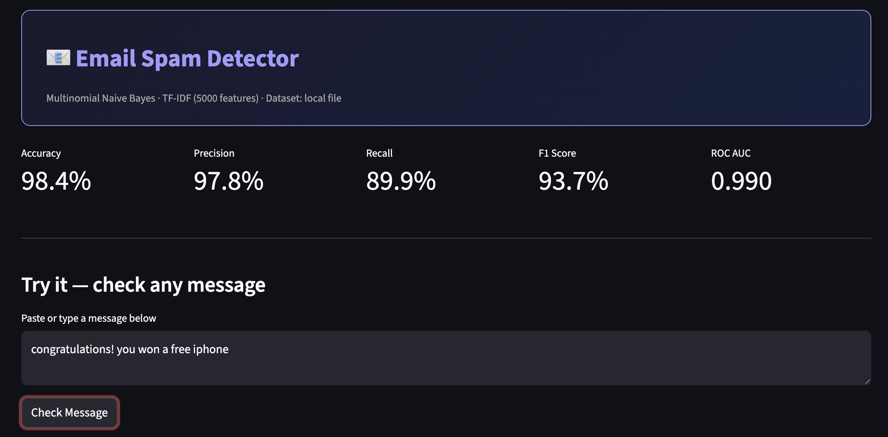
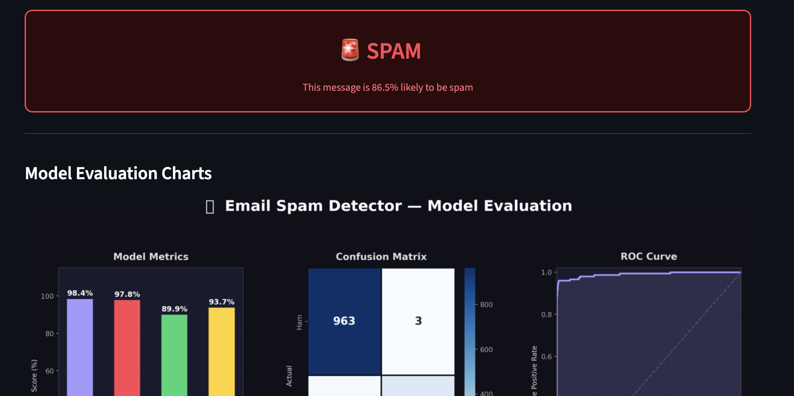
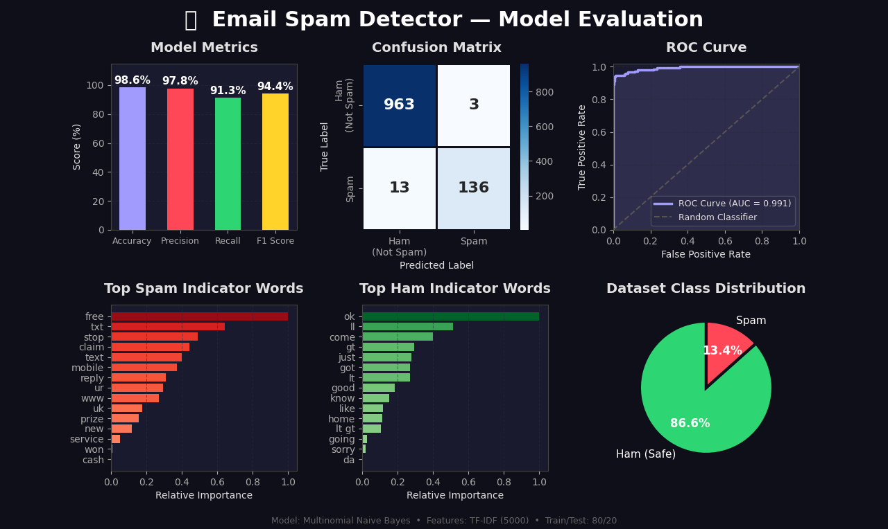

# 📧 Email Spam Detector

An end-to-end **NLP-based machine learning application** that classifies messages as **Spam 🚨 or Ham ✅** using TF-IDF and Multinomial Naive Bayes, with an interactive Streamlit interface.

---

## 🚀 Demo Preview

---

## 🧠 Project Overview

This project uses Natural Language Processing (NLP) techniques to detect spam messages. It transforms text data into numerical features using **TF-IDF vectorization** and applies a **Multinomial Naive Bayes classifier** to make predictions.

The app also provides **real-time predictions**, **performance metrics**, and **visual insights** into model behavior.

---

## ✨ Features

- 🔍 Real-time spam detection  
- 📊 Model evaluation (Accuracy, Precision, Recall, F1-score, ROC-AUC)  
- 📉 Confusion Matrix & ROC Curve visualization  
- 🧠 Feature importance (Top spam & ham words)  
- 📂 Dataset analysis & class distribution  
- 🎨 Clean and interactive Streamlit UI  

---

### 🔹 Main Interface

---

### 🔹 Prediction Output

---

### 🔹 Model Evaluation & Insights

---

## 🛠️ Tech Stack

- Python  
- Pandas, NumPy  
- Scikit-learn  
- Matplotlib, Seaborn  
- Streamlit  

---

## 📂 Project Structure
Email_Spam_Detector/
│── spam_detector.py
│── SMSSpamCollection
│── requirements.txt
│── spam_app1.png
│── spam_app2.png
│── spam_detector.png
│── Spam Detector.pdf

---

## 📊 Model Details

- **Algorithm:** Multinomial Naive Bayes  
- **Feature Extraction:** TF-IDF (5000 features, bi-grams)  
- **Train-Test Split:** 80:20 (stratified)  

### 📈 Performance
- Accuracy: ~98%  
- Precision: ~97%  
- Recall: ~90%  
- F1 Score: ~94%  
- ROC AUC: ~0.99  

---

## ⚠️ Observations

- High precision ensures fewer false positives  
- Slightly lower recall indicates some spam messages may be missed  
- Model performs strongly on imbalanced dataset  

---

## 🔮 Future Improvements

- 🔗 API integration (FastAPI)  
- 📂 Batch message classification  
- 🤖 Try advanced models (Logistic Regression, SVM)  
- ☁️ Cloud deployment optimization  

---

## 👩‍💻 Author

**Qamareen Fatima**

---

